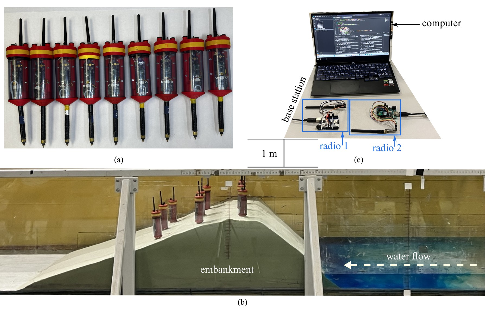

# Sensing Earthen Embankment Processes (SEEP)
The Sensing Earthen Embankment Processes (SEEP) dataset obtained at the University of South Carolina

The **SEEP Dataset** is an open research dataset for studying seepage, saturation, erosion, and piping-related behavior in a laboratory-scale earthen embankment. The dataset includes electrical-conductivity-based sensor measurements collected from a wireless sensing spike network, along with videos and images of the physical experiment.

Overall wireless communication of a network of nine sensing spike packages, displaying: (a) network of nine wireless sensing spike packages, (b) layout of the flume setup, and (c) detailed layout of the base station.

Overall view of the embankment for the experimental setup, showing: (a) cross-sectional view with dimensions of the levee structure; (b) side view of the real levee structure; and (c) top view of the real levee structure.

## Licensing and Citation

[![CC BY-SA 4.0][cc-by-sa-shield]][cc-by-sa]

This work is licensed under a
[Creative Commons Attribution-ShareAlike 4.0 International License][cc-by-sa].

[cc-by-sa]: http://creativecommons.org/licenses/by-sa/4.0/
[cc-by-sa-image]: https://licensebuttons.net/l/by-sa/4.0/88x31.png
[cc-by-sa-shield]: https://img.shields.io/badge/License-CC%20BY--SA%204.0-lightgrey.svg

Cite as:

@Misc{ARTSLabSEEP,     
  author = {Sydney Morris and Puja Chowdhury and Malichi Flemming and Ayman Mokhtar and Austin R.J. Downey and Jasim Imran and Sadik Khan},  
  howpublished = {GitHub},    
  title  = {Sensing Earthen Embankment Processes {(SEEP)}},    
  groups = {{ARTS-L}ab},    
  url    = {https://github.com/ARTS-Laboratory/dataset-SEEP},   
  note        = {Accessed: Month dd, yyyy},   
}

QR code for repo.

