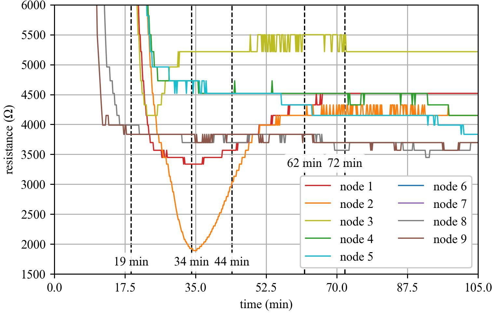

# Dataset-1

This repository contains four primary data files:

* **Top-view video**   
  Video recording of the experiment from above the embankment.

* **Side-view video**  
  Video recording of the experiment from the side of the embankment.

* **Electrical potential measurements**  
  Time-series electrical potential measurements from the wireless sensing spike packages.

* **Resistance measurements**  
  Time-series resistance values calculated from the measured electrical potential. These resistance values are the primary processed sensor data used for soil saturation mapping and analysis.

  